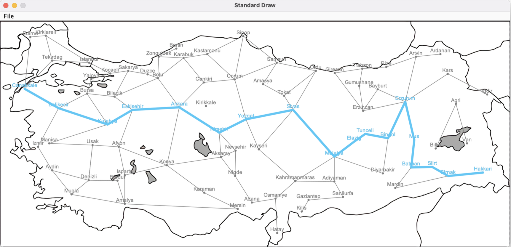

# Turkey Navigation – Dijkstra-Based Pathfinding in Java

Turkey Navigation is a graphical application that computes and visualizes the shortest path between cities in Turkey using Dijkstra’s algorithm. This project was developed as the second assignment of **CMPE160 – Object-Oriented Programming** at Boğaziçi University, Spring 2023.

## Overview

The program reads a set of predefined Turkish cities and their pairwise distances, then computes the shortest path between a user-defined source and destination city using Dijkstra’s algorithm. It also draws the computed path on a coordinate-based map of Turkey.

## Features

- Graph-based pathfinding using Dijkstra’s Algorithm
- Visualization of cities and paths on a 2D map
- Console-based input for start and end cities
- Input validation with proper error handling
- Step-by-step output showing total path distance and visited cities

## Controls

- Enter city names through the terminal when prompted
- If a city name is invalid or misspelled, the user is prompted to try again

## Technical Details

- **Language**: Java
- **Library**: StdDraw for graphical visualization
- **Graph Representation**: Adjacency matrix with `Double.MAX_VALUE` for unreachable pairs
- **Shortest Path Calculation**: Standard Dijkstra’s Algorithm
- **Visualization**:
  - Cities displayed as dots
  - Paths drawn between connected cities on the route

## File Structure

```
turkey-navigation/
├── src/
│   ├── Main.java
│   └── City.java
├── docs/
│   ├── report.pdf
│   ├── example.png
│   ├── map.png
│   ├── city_connections.txt
│   └── city_coordinates.txt
├── README.md
```

## Example Output

Below is a screenshot of the shortest path computed from **Çanakkale** to **Hakkari**:



## Run Instructions

1. Compile `Main.java` and `City.java` using any Java IDE or from terminal with:
   ```bash
   javac src/*.java
   java -cp src Main
   ```
2. Enter valid Turkish city names when prompted.

## Course

CMPE160 – Object-Oriented Programming  
Boğaziçi University, Spring 2023

## License

This project is licensed under the MIT License. See the `LICENSE` file for details.
